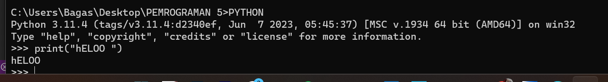
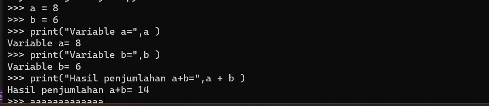
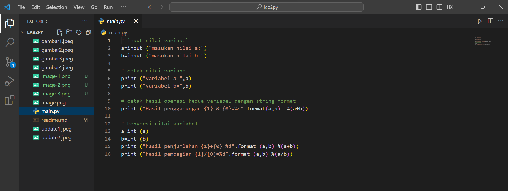
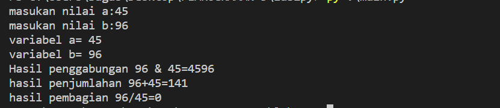

# Praktikum python

## Latihan 1

* Menjalankan Python Console
* Menampilkan tulisan “Hello” dilayar
```
Print("Hello")
```
### maka outputnya


* Menampilkan tulisan “Saya sedang belajar python” dilayar
```
Print("Saya sedang belajar python")
```
### maka outputnya!
[Alt text](image-2.png)

## Latihan 2

* Menjumlahkan dua buah bilangan menggunakan variabel a dan b.
* Mendefinisikan variable a dengan nilai 8
* Mendefinisikan variable b dengan nilai 6
* Mencetak nilai variable a dan b
* Mencetak hasil penjumlahan a+b
```
a = 8
b = 6
print("Variable a=",a )
print("Variable b=",b )
print("Hasil penjumlahan a+b=",a + b )
```
### maka outputnya


## Latihan 3

* Menjalankan VSCODE
* Membuat file baru dengan nama latihan3.py (pastikan lokasi file
pada folder lab2py pada direktori kerja anda)
* Menggunakan fungsi input untuk mengambil nilai variabel dari
keyboard.



### Maka Outputnya


